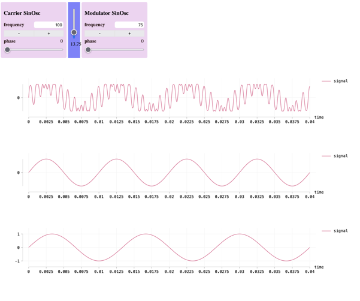

The goal was to test how to display curves in the browser as part of an interface project with a super collider engine.




You can see several view from elm reactor.

```
$ cd src
$ elm reactor
```

Or you have a full working demo: `build/index.html`, just open it with you browser.
